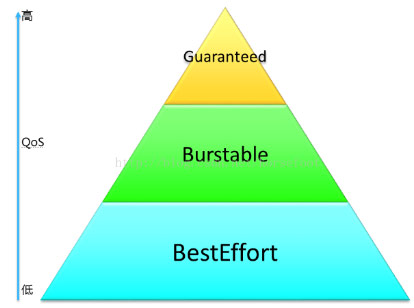
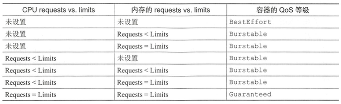

# QoS

当kubernetes集群中某个节点上可用资源比较小时，kubernetes提供了资源回收策略来保证节点上POD正常运行。因为如果节点上的内存或者CPU资源耗尽时，这个节点上运行的POD就会变成不稳定。
>在提高资源利用率、降低成本的同时，需要在服务的QoS与优化资源利用率之间有个平衡。我们的原则是在保证服务质量的同时，尽量提高资源的利用率。

Kubernetes通过kubelet来进行回收策略控制，保证节点上POD在节点资源比较紧张时可以稳定运行。Kubelet提供QoS服务质量管理，支持系统级别的OOM控制。
在Kubernetes中，POD的QoS服务质量一共有三个级别，如下图所示：

这三个QoS级别介绍，可以看下面表格：

| QoS级别 | QoS介绍 |
| :------| :------ |
| BestEffort | POD中的所有容器都没有指定CPU和内存的requests和limits，那么这个POD的QoS就是BestEffort级别 |
| Burstable  | POD中只要有一个容器，这个容器requests和limits的设置同其他容器设置的不一致，那么这个POD的QoS就是Burstable级别 |
| Guaranteed |  POD中所有容器都必须统一设置了limits，并且设置参数都一致，如果有一个容器要设置requests，那么所有容器都要设置，并设置参数同limits一致，那么这个POD的QoS就是Guaranteed级别 |

***为pod分配 BestEffort 等级***
最低优先级的QoS等级是 BestEffort， 当pod 没有设置requests和limits的时候，就是这个级别；这个级别的pod没有任何资源保障，最坏情况下，它们得不到CPU时间，同时，在需要为其它pod释放内存时， 这些容器会被先杀死。但是与之相反的是，这些Pod没有设置limits， 当有充足资源时，这些容器可以使用任意多的资源。

***为pod分配 Guaranteed 等级***
与 BestEffort 相对的就是 Guaranteed, 当pod 设置 requests和limits相当的时候，就是这个级别， 对于 Guaranteed 级别的pod， 有以下几个条件：
1. CPU 和 Memory 都需要设置 requests和limits
2. 每个容器都需要设置资源量
3. 它们必须相等( 每个容器的每种资源的 requests和limits 都相等)

如果没有显示设置 requests ， 默认与 limits 相等，所以只设置所有资源的限制量就可以使POD的QoS级别为 Guaranteed， 这些pod 的容器可以使用它所申请的等额资源， 无法消耗更多的资源。

***为pod分配 Burstable 等级***  
Burstable 等级介于 BestEffort 和 Guaranteed之间， 其它所有pod都属于这个级别，包括 容器的 requests 和 limits 不相等的单容器pod， 至少一个容器只定义了 requests 但是没有定义 limits的pod，以及一个容器的 requests 和 limits相等， 但是另一个容器不指定 requests 和 limits 的pod。 BestEffort 的pod 可以获得它们所申请的等额资源，并可以使用额外的资源(不会超过limits)，

*** 根据 requests 与 limits 之间的关系定义QoS ***

*** 根据 requests 与 limits 的单容器 QoS等级 ***

*** 根据多容器QoS等级推论Pod的QoS等级 ***

**总结：** 对于多容器pod， 如果所有容器的QoS等级相同， 那么这个等级就是pod的 QoS 等级。如果至少有一个容器的 QoS 等级与其它不同， 无论这个容器什么等级， 这个pod的QoS等级都是 Burstable；

### 先杀谁

kubelet可以提前监控到节点上资源紧张，并且及时做出控制操作，可以停止某些POD，然后让调度来在其他节点上启动这些POD，这样就可以保证节点上资源足够POD使用。POD的优先级就越低，在出现资源竞争的时候，就越早被kill掉。

***如何处理相同 QoS 级别的容器***  
每个运行中的进程，都有一个称谓 Out Of Memory(OOM) 的分数值。系统通过比较所有运行的进程的OOM分数来选择要杀掉哪个进程。当需要释放内存时，分数最高的进程被先杀死。
OOM计算取决于两个参数： 进程已消耗内存的占可用内存的百分比，与一个基于pod QoS等级和容器内存申请量固定的OOM分数调节因子。对于两个同属于 Burstable 的 pod， 系统会先杀掉内存实际使用量占内存申请量的比例更高的pod。 所以pod B先被杀掉，尽管 pod C比pod B使用了更多的内存。

#### 最佳实践：
1. Kubernetes 自带的组件使用Guarantee
2. 重要的组件和应用，比如ZooKeeper、Redis，ES、用户服务等使用Guarantee
3. 普通的应用（Burstable）按照重要性分级，按重要程度CPU分为2，5，10三个超卖标准，10倍超卖适合boss后台类的应用，大多数适合访问量不高。
4. 内存使用固定的1.5倍超卖标准。
5. 在生产环境中，不要使用 BestEffort 的方式，它会引发不确定的行为。

思考：静态POD会被回收吗？

#### 参考
https://kubernetes.io/docs/tasks/configure-pod-container/quality-service-pod/
