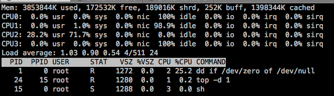

# 为 Pod 中容器申请资源
一个Pod的资源请求量(requests)和限制量(limits) 是它所包含的所有容器的请求量以及限制量；但是在创建pod的时候，
可以针对容器单独申请CPU和Memory的资源；

创建一个测试的ns
```bash
kubectl create namespace pod-resource-qos
```
***cpu requests***
```yaml
cat << EOF > pod-resource-qos-explame.yaml
apiVersion: v1
kind: Pod
metadata:
  name: requests-pod
spec:
  containers:
  - name: main
    image: busybox
    imagePullPolicy: IfNotPresent
    resources:
      requests:
        cpu: 200m
        memory: "10Mi"
    command: ["dd","if=/dev/zero","of=/dev/null"]
EOF
```
运行pod并验证
```bash
kubectl apply -f pod-resource-qos.yaml -n pod-resource-qos
```
在pod manifest 中，我们为主容器申请了200毫核(即一个CPU时间的1/5)的CPU， 10M 的Memory。requests的意义，如果对于
容器来说，我们可以理解成是保底使用资源，对于调度器来说，在调度的时候，具备这些 requests 资源的node才满足调度需求。但是
容器实际上能用多少呢？


因为dd是单线程运行，所以最多也就跑满一个核， 而我们的虚拟机有4个核，所以cpu使用率为25%。但是这显然超过了我们在 pod 中定义申请的200m cpu，这也是符合预期的，因为 requests 不会限制容器可以使用多少CPU，
***当limit值未指定时，其有效值其实是对应Node Resource的Capacity。*** 因为限制资源使用需要使用limites， 但是，如果集群中的pod都没有设置limits，那么 requests 会不会影响CPU的时间分配呢？
比如，我们创建三个pod，需要在一个node上测试，所以要保证三个pod调度到同一台宿主上：
首先要解决如何调度pod到同一台宿主：
```yaml
# 这里通过节点选择器 nodeSelector 的策略，实现生成的pod 调度到 同一台宿主上
spec:
  nodeSelector:
    kubernetes.io/hostname: 192.168.10.243
```
使用nodeSelector 初级调度策略来实现，可参考 [assign-pods-nodes]( https://kubernetes.io/docs/tasks/configure-pod-container/assign-pods-nodes/)

```yaml
cat << EOF > pod-request-stress.yaml
---
apiVersion: v1
kind: Pod
metadata:
  name: requests-pod-2000
spec:
  nodeSelector:
    kubernetes.io/hostname: 192.168.10.243
  containers:
  - name: main
    image: ubuntu-stress
    imagePullPolicy: IfNotPresent
    resources:
      requests:
        cpu: 2000m
        memory: "10Mi"
    command: ["stress","-c","4"]
---
apiVersion: v1
kind: Pod
metadata:
  name: requests-pod-1000
spec:
  nodeSelector:
    kubernetes.io/hostname: 192.168.10.243
  containers:
  - name: main
    image: ubuntu-stress
    imagePullPolicy: IfNotPresent
    resources:
      requests:
        cpu: 1000m
        memory: "10Mi"
    command: ["stress","-c","4"]
---
apiVersion: v1
kind: Pod
metadata:
  name: requests-pod-3000
spec:
  nodeSelector:
    kubernetes.io/hostname: 192.168.10.243
  containers:
  - name: main
    image: ubuntu-stress
    imagePullPolicy: IfNotPresent
    resources:
      requests:
        cpu: 1000m
        memory: "10Mi"
    command: ["stress","-c","4"]   
    
```
创建pod：
```bash
$ kubectl create -f pod-request-stress.yaml -n pod-resource-qos
```
创建完成之后， 在宿主上执行如下命令查看各容器运行情况：

***总结***
如果一个容器能够跑满CPU, 而另一个容器在该时段处于空闲状态， 那么前者将可以使用整个CPU时间(减掉其它容器基本耗时)， 相反，如果所有容器都能把CPU跑满，则按照 requests 的值计算出权重，然后，按照权重比例给各容器分配CPU时间。

***cpu limits***
上面的例子我们看到，当其它进程处于空闲状态时，容器可以被允许使用所有CPU资源。但是你想防止一些容器使用超过指定的CPU以及内存。
CPU是一种可压缩资源， 意味着我们可以在不对容器内运行的进程产生不利影响的同时，对其使用量进行限制。而内存是一种不可压缩资源， 一旦系统为进程分配了一块内存，这块内存咋进程主动释放之前将无法被回收，这就是我们为什么要限制容器的可消耗内存的数量。
如果不对内存进行限制， 工作节点上的容器(pod)， 可能会吃掉所有可用的内存，对该节点上的所有其它容器造成影响。单个故障pod或者恶意pod几乎可以导致整个节点不可用。

创建一个带有资源limits的pod
```yaml
cat << EOF > pod-resource-limit-example02.yaml
apiVersion: v1
kind: Pod
metadata:
  name: limit-pod
spec:
  containers:
  - name: main
    image: busybox
    imagePullPolicy: IfNotPresent
    resources:
      limits:
        cpu: 200m
        memory: "20Mi"
    command: ["dd","if=/dev/zero","of=/dev/null"]
```
```bash
$ kubectl apply -f pod-resource-limit-example02.yaml -n pod-resource-qos
```
这个容器内的进程不允许消耗超过200m的cpu和20m的memory。
***ps***
>因为没有指定资源requestes, 它将被设置成与limits相同的值

运行效果如下：


----
***Memory limits***
当容器内运行的进程尝试使用比限额更多的资源时会发生什么呢？
CPU资源是可压缩资源，当进程不等待IO操作耗时所有的CPU时间是很常见的， 对一个进程的CPU使用率可以限制，因此当为一个容器设置CPU限制时， 该进程只会分不到比限额更多的CPU而已。  
而内存却有所不同，当进程尝试申请更多的内存资源时(突破限制)会被杀掉。或者说这个进程被OOMKilled了，OOM（Out Of Memory的缩写）。如果pod的重启策略是Always或者OnFailure，进程会立即重启，如果再次超限，K8S 会再次重启，但是会增加重启的间隔时间，这种情况会看到pod处于 CrashLoopBackOff状态, CrashLoopBackOff状态 说明kubelet还没有放弃，第一次重启的间隔为10s， 也就是kubelet会等待10s再重启它， 随着不断的OOM， 延迟也会增加，会按照20s，40s，80s ，160s以几何倍数增长，最终收敛到300s。一旦时间间隔达到300s，Kubelet 将以5分钟为间隔对容器进行无限制重启，直到容器正常运行或者被删除。
```yaml
cat << EOF > pod-resource-limit-example03.yaml
apiVersion: v1
kind: Pod
metadata:
  name: limit-mem-pod
spec:
  nodeSelector:
    kubernetes.io/hostname: 192.168.10.243
  containers:
  - name: main
    image: ubuntu-stress
    imagePullPolicy: IfNotPresent
    resources:
      limits:
        cpu: 200m
        memory: "100Mi"
    command: ["stress","--vm","1" ,"--vm-bytes", "400M"]
EOF    
```
```bash
$ kubectl apply -f pod-resource-limit-example03.yaml -n pod-resource-qos
```
如何定位容器crash的原因呢？
```bash
# kubectl  describe pod limit-mem-pod -n pod-resource-qos
Command:
  stress
  --vm
  1
  --vm-bytes
  400M
State:          Waiting
  Reason:       CrashLoopBackOff
Last State:     Terminated
  Reason:       OOMKilled
  Exit Code:    1
  Started:      Sat, 30 Mar 2019 15:01:57 +0800
  Finished:     Sat, 30 Mar 2019 15:01:57 +0800
Ready:          False
Restart Count:  4
```

***总结***  
与资源requests 不同的是，资源limits 不受节点可分配资源量的约束。所有limits的总和是允许超过节点资源总量的100%的，也就是说， 资源limits可以超卖。


如果节点资源真实使用率达到100%或者上限，一些容器将被杀掉，这是一个很重的结果。但是具体怎么杀容器呢？ 需要了解一下QOS策略。
请确保演示功能已经实现，清扫环境
```bash
$ kubectl delete namespace  pod-resource-qos
```
#### 参考
https://kubernetes.io/docs/tasks/configure-pod-container/assign-memory-resource/
https://kubernetes.io/docs/tasks/configure-pod-container/assign-cpu-resource/
